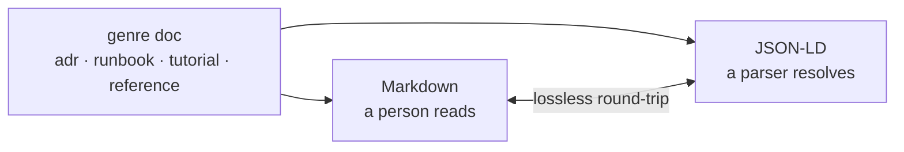

## Every document, two readers

Each genre skill writes a document in its native industry pattern over a MIF
floor: the same artifact is a human-readable doc and a machine-conformant unit
that projects losslessly to canonical JSON-LD.

Browse the suite's own documentation — itself authored with these skills and
validated by `mif-validate`: the [tutorial](tutorials/getting-started/), the
[genre &amp; CLI reference](reference/genre-and-cli-catalog/), the
[architecture](architecture/arc42/), and the [decision records](adr/).
