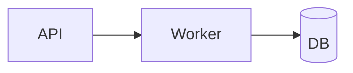

# Architecture: Notification Service

<!-- ANTIPATTERN: a composite architecture doc that is only a picture. -->

## Diagram

That's the architecture.

<!-- ANTIPATTERN: no Context section — drivers and external dependencies are
     undocumented. -->

## Notes

It should scale and be secure.

<!-- ANTIPATTERN: no Non-Functional Requirements. "Scale and be secure" is not
     testable; there are no measurable, EARS-style NFRs an implementer can
     verify. -->

<!-- ANTIPATTERN: no Decision Log at all — none of the architectural choices
     (why a queue, why this datastore) are captured, so the rationale is lost
     and the next engineer cannot tell intent from accident. -->
