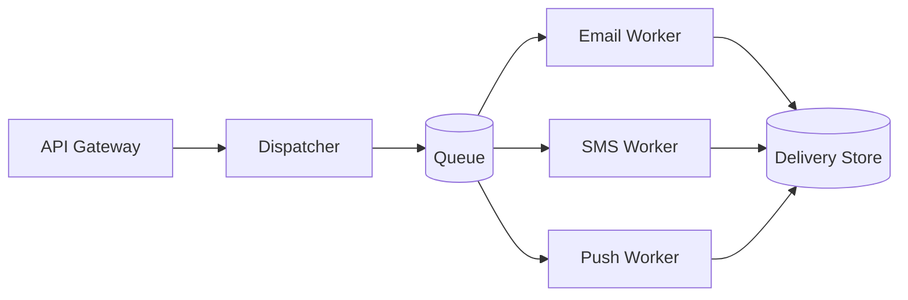

# Architecture: Notification Service

## Context

The Notification Service delivers transactional messages (email, SMS, push) on
behalf of other internal services. Drivers: a single send API, per-channel
provider failover, and an auditable delivery record. External dependencies: the
email provider, the SMS provider, and the push gateway.

## Architecture

### Building blocks

- **API Gateway** — authenticates callers, validates the send request.
- **Dispatcher** — selects a channel + provider, enforces rate limits, enqueues.
- **Channel Workers** — one pool per channel; call the provider, record status.
- **Delivery Store** — append-only record of every send attempt and outcome.

### Component view (C4 Level 3, Dispatcher)

## Non-Functional Requirements

1. WHEN a send request is accepted, the service SHALL enqueue it within 200 ms
   (p95).
2. IF a provider returns a transient error, THEN the worker SHALL retry with
   exponential backoff up to 5 attempts before marking the send failed.
3. The service SHALL retain every delivery record for at least 1 year (audit).
4. WHILE a provider is failing health checks, the dispatcher SHALL route that
   channel to its secondary provider.

## Decision Log

### AD-1: Queue-backed dispatch — Accepted

Decouples acceptance from delivery so provider latency never blocks callers.
Consequence: delivery is asynchronous; callers poll or subscribe for status.

### AD-2: Append-only Delivery Store — Accepted

Chosen over mutable status rows to preserve a full audit trail. Consequence:
status is derived from the latest event per send, not an in-place update.
