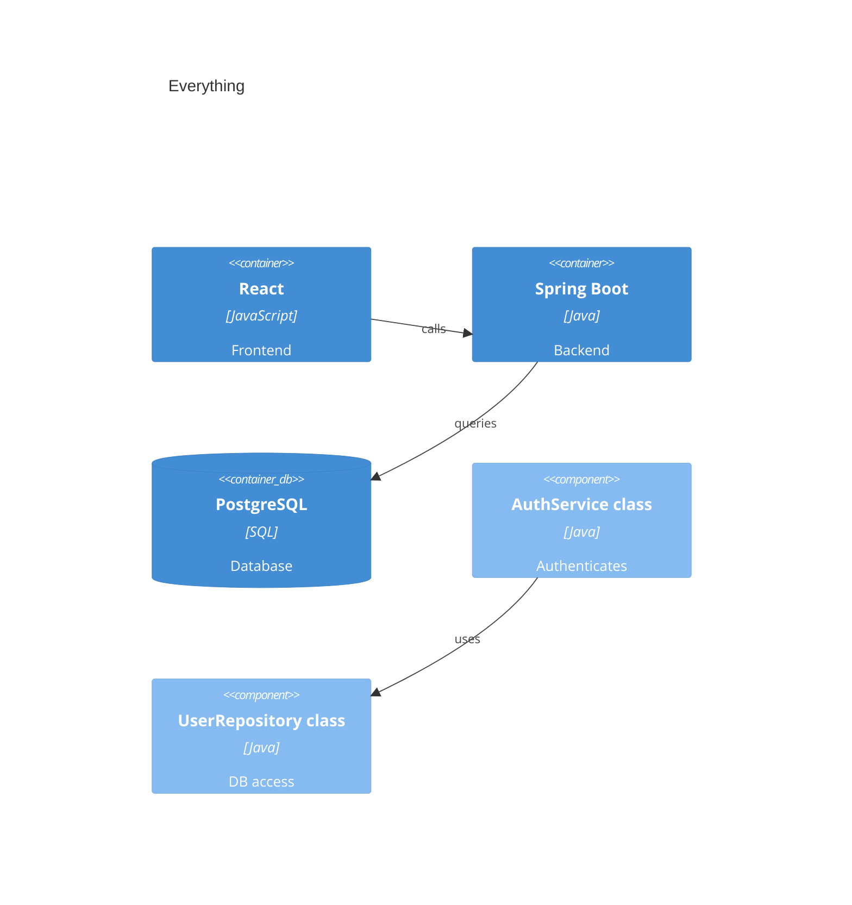

# Architecture Diagram

<!-- ANTIPATTERN: titled "Architecture Diagram" with no stated level of
     abstraction. C4 is four explicit levels; an unlabelled single picture is
     not a C4 model. -->

This is our system. It shows everything in one diagram.

<!-- ANTIPATTERN: "everything in one diagram" — C4 deliberately spreads
     abstraction across separate Context / Container / Component views. Cramming
     all levels into one picture defeats the whole point. -->

<!-- ANTIPATTERN: mixes abstraction levels — containers (React, Spring Boot,
     PostgreSQL) and Level-4 code elements (AuthService class, UserRepository
     class) live in the SAME diagram. One level of abstraction per diagram. -->

<!-- ANTIPATTERN: there is no Person() and no Container_Boundary — only technical
     boxes. With no actors and no system boundary this is an arbitrary tech
     sketch, not C4. People and a boundary are mandatory at Level 1. -->

<!-- ANTIPATTERN: relationships are unlabelled or vague ("calls", "queries",
     "uses") with no intent and no protocol. C4 relationships must say what
     flows and how. -->

## Components

The boxes are named after frameworks (React, Spring Boot, PostgreSQL) instead of
their role in the system.

<!-- ANTIPATTERN: naming containers after technologies rather than
     responsibilities. The name should describe what the container IS (e.g.
     "Single-Page App"); the technology belongs in the technology field. -->

## What it does

Configure the rest of the architecture as appropriate for your environment.

<!-- ANTIPATTERN: "as appropriate" — vague filler. A model is a concrete claim
     about the system, not a placeholder. -->
