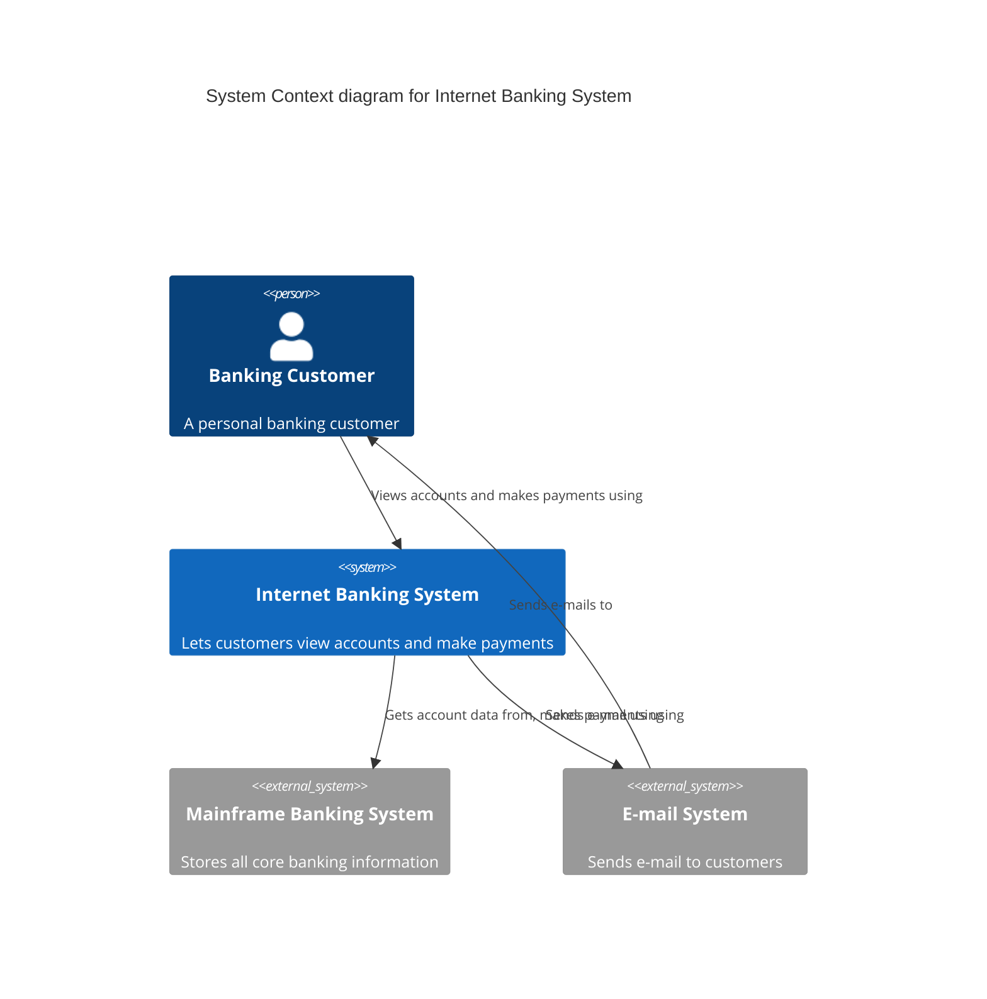
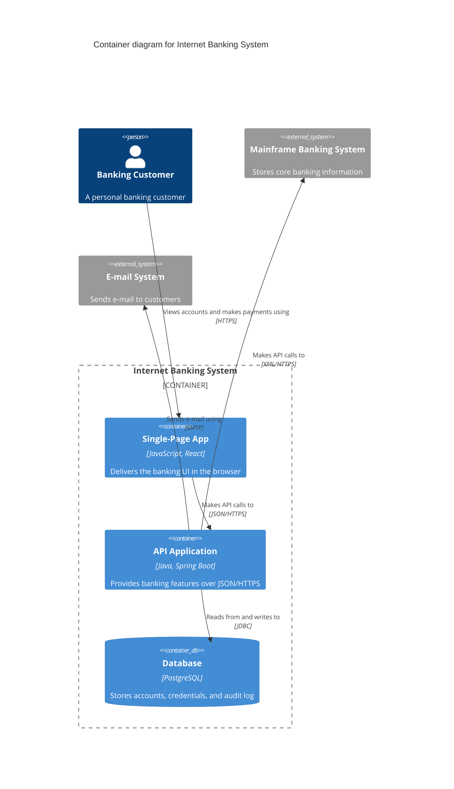
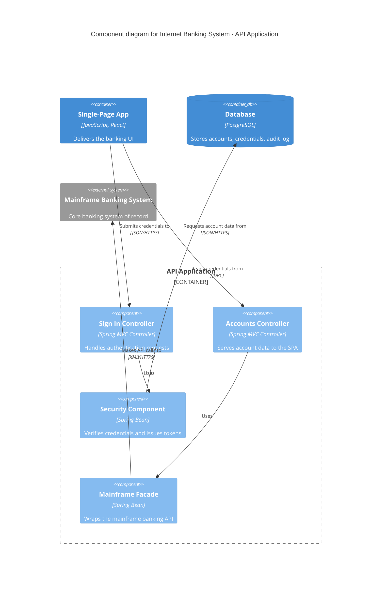

# Internet Banking System — C4 Model

This model describes the Internet Banking System at three C4 levels of
abstraction. Each diagram zooms in one level; the Code level (Level 4) is
deliberately omitted. The element catalogs below each diagram are the durable
record — the diagrams are one Mermaid rendering of those abstractions.

## Level 1 — System Context

How the Internet Banking System fits into the world: who uses it and which
other systems it depends on.

| Element | Kind | Responsibility |
| --- | --- | --- |
| Banking Customer | person | Views balances and makes payments online. |
| Internet Banking System | system (in scope) | Provides online banking to customers. |
| Mainframe Banking System | external system | System of record for accounts and transactions. |
| E-mail System | external system | Delivers notifications to customers. |

## Level 2 — Container

Zooming into the Internet Banking System to show its deployable/runnable
containers and how they communicate.

| Element | Kind | Responsibility |
| --- | --- | --- |
| Single-Page App | container | Renders the banking interface in the browser. |
| API Application | container | Serves banking functionality to the SPA. |
| Database | container (datastore) | Persists accounts, credentials, and audit records. |
| Mainframe Banking System | external system | Source of truth reached via the API Application. |
| E-mail System | external system | Sends customer notifications. |

## Level 3 — Component

Zooming into the **API Application** container to show its major components.
The container name matches the Level 2 diagram exactly.

| Element | Kind | Responsibility |
| --- | --- | --- |
| Sign In Controller | component | Accepts sign-in requests and delegates to security. |
| Accounts Controller | component | Returns account data for the authenticated customer. |
| Security Component | component | Validates credentials and mints session tokens. |
| Mainframe Facade | component | Adapts the mainframe protocol for internal use. |

## Notes

- Level 4 (Code) is intentionally omitted: it ages quickly and is better
  generated on demand from the IDE.
- Every relationship is labelled with intent and, where it matters, protocol.
- Technology tags sit on containers and components only — never on people or
  external systems.
- This C4 model is the kind of artifact an **arc42** architecture document
  embeds in its §3 *Context and Scope* (Level 1) and §5 *Building Block View*
  (Levels 2–3) sections — the `relates-to` relationship in the frontmatter
  records that genre-level link, not a claim that any specific arc42 document
  reproduces these exact diagrams.

<!--
MIF Level 3: this same C4 model now carries machine-actionable metadata. A
consumer can, by reading frontmatter alone (no prose parsing):
  - decide whether the view is still current — temporal.validFrom/validUntil
    (a P1Y validity window) flags it for review after 2027-06-29;
  - know what kind of document this is — the architecture-view ontology type,
    distinct from a decision-record or a runbook;
  - trace where it came from and how far to trust it — W3C-PROV provenance marks
    it external_import / verified, derived from the canonical c4model.com
    Internet Banking example;
  - walk to the larger architecture document that embeds it — the typed
    relates-to relationship into the arc42 genre.
The document still reads as a human C4 model and projects losslessly to JSON-LD
and back. Compare good-l1.md, the same model at the L1 floor (opaque prose).
-->
