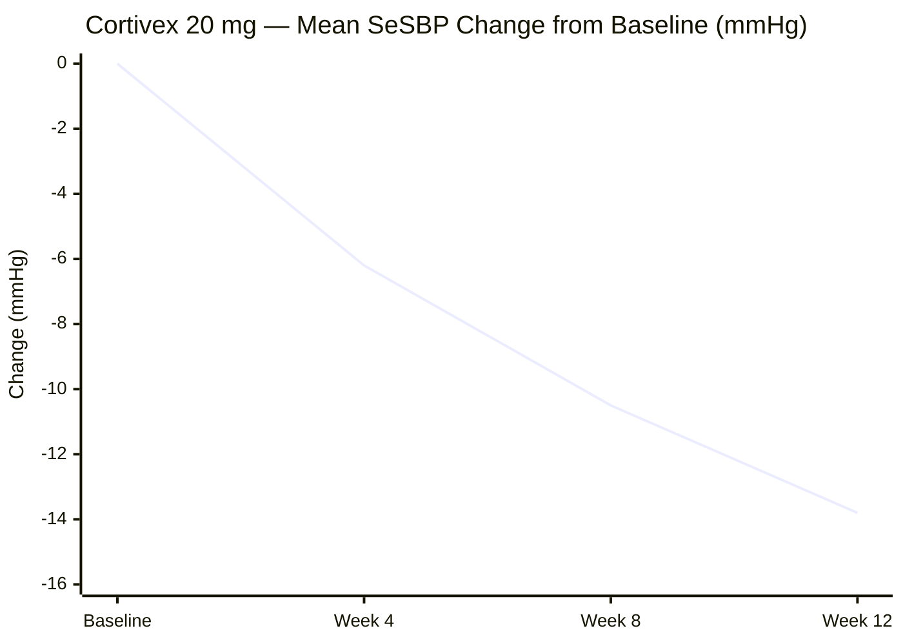

# Clinical Study Report: CARDIA-3 — A Phase III Trial of Cortivex in Essential Hypertension

**Scope caveat:** this report reproduces the ICH E3 clinical-study-report
structure within the CTD module frame. It does not assert clinical validity,
statistical adequacy, or regulatory acceptance. Cortivex is a fictional
compound used for illustration only.

**CTD framing:** this document is an ICH E3 clinical study report and, in the
five-module Common Technical Document frame, belongs in **Module 5** (clinical
study reports). M1 (regional administrative), M2 (summaries), M3 (quality),
and M4 (nonclinical study reports) are out of scope here.

## Synopsis

CARDIA-3 was a randomized, double-blind, placebo-controlled, parallel-group
Phase III trial of once-daily oral Cortivex 20 mg in adults with essential
hypertension (baseline seated systolic blood pressure 150-179 mmHg). 1,240
participants were randomized 1:1 across 42 sites. The primary efficacy
objective — superiority in mean seated systolic blood pressure (SeSBP)
reduction from baseline at Week 12 versus placebo — was met. Cortivex was
generally well tolerated; the most common adverse event was mild dizziness.

## Ethics

The protocol and informed consent documents were reviewed and approved by each
site's institutional review board / independent ethics committee prior to
enrollment. The trial was conducted in accordance with the ethical principles
of the Declaration of Helsinki and ICH E6 Good Clinical Practice. All
participants provided written informed consent before any study procedure.

## Investigators & Study Structure

The trial was sponsored by a fictional sponsor ("Northfield Therapeutics,
fictional") and conducted at 42 sites across three countries. A steering
committee of five investigators oversaw protocol conduct; an independent Data
Safety Monitoring Board (DSMB) reviewed unblinded safety data at two
prespecified interim analyses.

## Objectives

- **Primary objective**: demonstrate superiority of Cortivex 20 mg over
  placebo in mean SeSBP reduction from baseline at Week 12.
- **Secondary objectives**: mean seated diastolic blood pressure (SeDBP)
  reduction at Week 12; proportion of participants achieving SeSBP < 140 mmHg
  at Week 12; long-term safety and tolerability through Week 52.

## Investigational Plan

Randomized, double-blind, placebo-controlled, parallel-group design.
Participants were randomized 1:1 via an interactive response system, stratified
by baseline SeSBP (< 165 mmHg vs >= 165 mmHg) and background antihypertensive
use. Blinding was maintained for participants, investigators, and outcome
assessors through database lock.

## Methods (Efficacy & Safety)

**Efficacy**: the primary endpoint was change from baseline in SeSBP at Week
12, analyzed by mixed-model repeated measures (MMRM) in the intent-to-treat
population. Secondary endpoints used the same analysis population and method.

**Safety**: adverse events, serious adverse events, and discontinuations due to
adverse events were summarized descriptively in the safety population (all
randomized participants who received at least one dose). Safety was analyzed
separately from efficacy throughout.

## Results

### Efficacy

The intent-to-treat population comprised 1,240 participants (620 per arm).
Cortivex reduced mean SeSBP by 9.4 mmHg more than placebo at Week 12 (95% CI
7.1 to 11.7 mmHg; MMRM). 61% of Cortivex-treated participants achieved SeSBP
< 140 mmHg at Week 12, versus 34% on placebo.

### Safety

The safety population comprised 1,238 participants who received at least one
dose. The most common adverse event was mild, self-limiting dizziness (8.1%
Cortivex vs. 3.2% placebo). Serious adverse event rates were similar between
arms (1.9% Cortivex vs. 1.7% placebo); none were assessed as treatment-related
by the investigator or the DSMB.

## Discussion & Conclusions

Cortivex met its primary efficacy objective with a clinically meaningful and
statistically significant SeSBP reduction versus placebo, and no excess in
serious adverse events was observed through Week 52. The principal limitation
is the trial's restriction to participants with baseline SeSBP 150-179 mmHg;
efficacy and safety in more severe or resistant hypertension were not
evaluated here. On balance, the benefit-risk profile observed in this
population supports the reported efficacy result, understood as reproducing
the CSR structure rather than a regulatory determination.

## Tables, Figures & Appendices

### Figure 1 — Mean SeSBP change from baseline, Cortivex 20 mg arm (ITT population)

The placebo arm's Week 12 change from baseline (-4.4 mmHg) is reported in
prose above; the between-arm difference is the primary efficacy result
(9.4 mmHg, 95% CI 7.1 to 11.7).

### Table 1 — Adverse events occurring in >= 2% of either arm (safety population)

| Adverse event | Cortivex 20 mg (n=619) | Placebo (n=619) |
| --- | --- | --- |
| Dizziness | 8.1% | 3.2% |
| Headache | 4.5% | 4.1% |
| Fatigue | 2.7% | 2.3% |

**Appendix A**: full statistical analysis plan (referenced, not reproduced
here). **Appendix B**: site list and investigator roster (referenced, not
reproduced here).

## References

1. ICH E3: Structure and Content of Clinical Study Reports — <https://database.ich.org/sites/default/files/E3_Guideline.pdf>
2. ICH E9: Statistical Principles for Clinical Trials — <https://database.ich.org/sites/default/files/E9_Guideline.pdf>

<!--
MIF Level 1 (floor): id, type, created + body. A complete, valid clinical
study report — but opaque to a machine consumer. It cannot be queried for "is
this still the current study record?", "where did the evidence come from?",
or "what relates to it (statistical analysis plan, protocol)?". Compare
templates/good.md (full L3: temporal validity, W3C-PROV provenance, per-claim
citations, typed relationships). Gate: mif-validate --level 1.
-->
