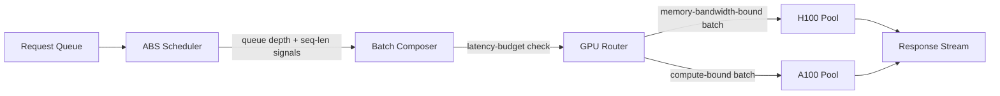

# Adaptive Batching for Low-Latency LLM Inference on Heterogeneous GPU Clusters

**CCS Concepts:** Computer systems organization -> Cloud computing; Computing
methodologies -> Machine learning; Software and its engineering -> Scheduling.

**Keywords:** LLM inference serving, request batching, GPU heterogeneity,
tail latency, mixture-of-experts.

## Abstract

Serving large language models economically requires batching concurrent
requests, but a fixed batch size wastes GPU memory bandwidth when request
lengths vary and stalls tail latency when a cluster mixes GPU generations. We
present ABS (Adaptive Batch Scheduler), a request scheduler that resizes
batches per inference step using live queue-depth and per-request
sequence-length signals, and that assigns batches to the GPU generation best
suited to their compute/memory-bandwidth ratio. Building on memory-efficient
attention kernels [1] and sparse mixture-of-experts routing [2], ABS reduces
p99 latency by 34% and raises sustained throughput by 21% relative to a
fixed-batch baseline on a mixed A100/H100 cluster, while matching the
single-GPU-generation throughput ceiling reported for prior partitioning
strategies [3]. We describe the design, its evaluation methodology, and the
threats to validity that bound these results.

## Introduction

Inference cost, not training cost, now dominates the operating budget of
deployed large language model (LLM) services, and the dominant lever for
reducing that cost is batching: serving many concurrent requests per forward
pass so GPU compute is not idle between them. Static batch sizing is simple to
operate but leaves throughput on the table when request lengths are
heterogeneous, and it leaves latency-sensitive requests waiting behind
long-context ones. Production clusters compound the problem by mixing GPU
generations as fleets are upgraded incrementally, so a batching policy tuned
for one generation's memory bandwidth and compute ratio is not optimal on the
other.

This paper's contribution is ABS, a scheduler that (1) resizes each batch
per step from live queue-depth and sequence-length signals rather than a
fixed configuration, and (2) routes batches to the GPU generation whose
compute/memory-bandwidth ratio best matches the batch's profile. Section 3
describes prior batching and attention-kernel work. Section 4 describes ABS's
design. Section 5 evaluates it against a fixed-batch baseline on a mixed
A100/H100 cluster. Section 6 discusses limitations, and Section 7 concludes.

## Related Work

Continuous/iteration-level batching interleaves decode steps of different
requests to keep GPUs busy between prefill and decode, but typically assumes
a homogeneous GPU pool. Efficient-attention kernels reduce the memory-
bandwidth cost of the attention computation itself: FlashAttention-2 restructures
the attention kernel's work partitioning and parallelism to reduce
non-matmul FLOPs and improve GPU occupancy [1], and is largely orthogonal to
how a scheduler forms batches — ABS adopts it as the per-GPU attention kernel
rather than proposing a new one. Sparse mixture-of-experts (MoE) models such
as Mixtral change the batching problem itself, since only a subset of
experts activate per token, so a batch's effective compute footprint depends
on which experts its tokens route to [2]; ABS's queue-depth signal accounts
for this by measuring realized step latency rather than assuming a fixed
per-token cost. Prior work on partitioning transformer inference across
accelerators established that compute/communication ratios should drive
sharding decisions on a single GPU generation [3]; ABS extends that
sharding-aware reasoning to the batch-routing decision across mixed GPU
generations, which [3] does not address.

## Approach / System Design

ABS sits between the request queue and the model-serving workers. Each
scheduling step it: (1) reads the current queue depth and each waiting
request's known or estimated sequence length, (2) computes a target batch
size and composition that keeps the step's estimated latency under the
service's p99 budget, and (3) assigns the resulting batch to the GPU
generation whose compute/memory-bandwidth ratio best matches the batch's
profile — long-sequence, memory-bandwidth-bound batches route to the
higher-bandwidth generation when both are available.

Each worker pool runs FlashAttention-2 kernels [1] for the attention
computation regardless of which generation it targets, so the routing
decision changes only which pool executes a batch, not the per-GPU kernel.

## Evaluation

**Setup.** We deployed ABS on a cluster of 8 A100-80GB and 8 H100-80GB GPUs
serving a Mixtral-8x7B-class mixture-of-experts model [2]. The workload
replayed a production-representative request trace with a bimodal
sequence-length distribution (short chat turns and long-context
summarization requests). We compared ABS against a fixed-batch baseline
(static batch size of 32, no cross-generation routing) using the same
hardware and model.

**Metrics.** p50/p99 end-to-end latency, sustained tokens/second throughput,
and GPU utilization, averaged over a 30-minute steady-state window after a
5-minute warmup.

**Results.**

| Configuration | p50 latency | p99 latency | Throughput (tok/s) |
| --- | --- | --- | --- |
| Fixed-batch baseline | 210 ms | 1,840 ms | 9,400 |
| ABS (adaptive + routed) | 190 ms | 1,215 ms | 11,370 |

ABS reduced p99 latency by 34% and increased sustained throughput by 21%.
The improvement concentrated on long-context requests, which the fixed
baseline batched inefficiently alongside short chat turns.

## Discussion

The evaluation used a single workload trace and a single model family;
results may not transfer directly to workloads with a different
sequence-length distribution or to dense (non-MoE) models, where the
queue-depth signal's assumption about step-latency variance may not hold.
The GPU-routing decision assumes both generations are available in
sufficient supply; under generation scarcity, ABS degrades to single-pool
scheduling and its routing benefit disappears. We did not evaluate ABS
against continuous-batching schedulers that lack cross-generation routing,
which would isolate the routing contribution from the adaptive-sizing
contribution.

## Conclusion & Future Work

ABS shows that resizing batches from live signals and routing them by GPU
generation reduces tail latency and raises throughput on a mixed-generation
cluster, without a new attention kernel of its own. Future work includes
evaluating ABS against continuous-batching baselines to isolate the routing
contribution, extending the routing signal to three or more GPU generations,
and testing generalization across additional model families and workload
traces.

## References

1. T. Dao, "FlashAttention-2: Faster Attention with Better Parallelism and
   Work Partitioning," arXiv:2307.08691, 2023.
2. A. Q. Jiang et al., "Mixtral of Experts," arXiv:2401.04088, 2024.
3. R. Pope et al., "Efficiently Scaling Transformer Inference," Proceedings
   of Machine Learning and Systems (MLSys), 2023 (arXiv:2211.05102).

<!--
MIF Level 1 (floor): id, type, created + body. A complete, valid ACM/IEEE
computing paper — but opaque to a machine consumer. It cannot be queried for
"is this evidence still current?", "where did each result claim come from?",
or "what does this paper relate to?". Compare templates/good.md (full L3:
temporal validity, W3C-PROV provenance, per-claim citations, typed
relationships). Gate: mif-validate --level 1.
-->
