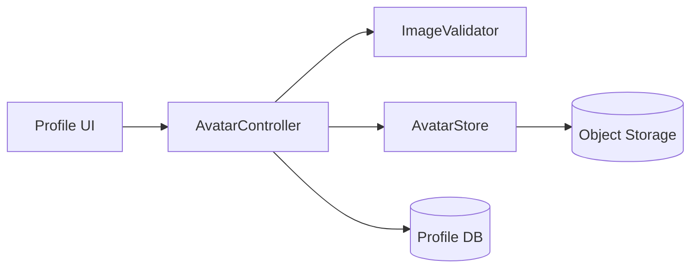

# Design: Profile Avatar Upload

## Overview

An `AvatarController` validates the image, delegates storage to an `AvatarStore`,
and updates the user's profile pointer (satisfies Requirements 1 and 2).

## Architecture

## Components and Interfaces

- **ImageValidator** — `validate(file)`; enforces PNG/JPEG and 5 MB (Req 1.2, 1.3).
- **AvatarStore** — `put(userId, bytes) -> url`, `delete(url)` (Req 3.1).
- **AvatarController** — orchestrates validate -> store -> update pointer (Req 1.1).

## Data Models

`Profile`: `user_id` (uuid, pk), `avatar_url` (string|null), `avatar_updated_at`
(timestamp).

## Error Handling

`too_large` / `unsupported` -> 400; storage failure -> 502, pointer unchanged.

## Testing Strategy

Unit-test the validator boundaries (Req 1.2/1.3); integration-test upload and
replace (Req 1.1, 3.1).

<!--
MIF Level 1 (floor): id, type, created + body. A machine consumer cannot trace
this design back to its requirements or forward to its tasks. good.md climbs to
L3 with temporal validity, provenance, and typed derived-from / realized-by
relationships, so the Kiro requirements -> design -> tasks chain is machine-traceable.
-->
