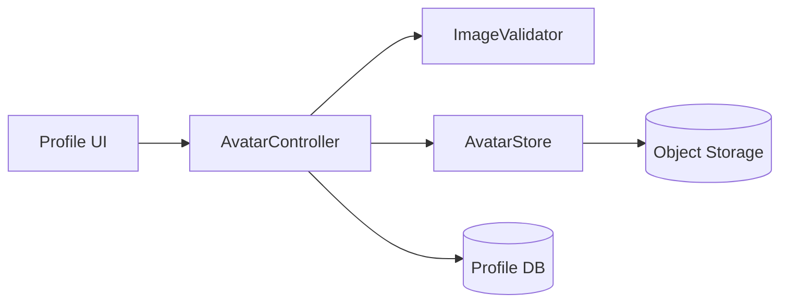

# Design: Profile Avatar Upload

## Overview

Avatar upload is handled by an `AvatarController` that validates the image,
delegates storage to an `AvatarStore`, and updates the user's profile pointer.
Previews are client-side; nothing is persisted until the user confirms
(satisfies Requirements 1 and 2).

## Architecture

## Components and Interfaces

- **ImageValidator** — `validate(file) -> Ok | Error{too_large | unsupported}`.
  Enforces PNG/JPEG and the 5 MB limit (satisfies Requirement 1.2, 1.3).
- **AvatarStore** — `put(userId, bytes) -> url`, `delete(url)`. Writes to object
  storage; schedules deletion of the prior image (satisfies Requirement 3.1).
- **AvatarController** — orchestrates validate -> store -> update profile
  pointer (satisfies Requirement 1.1).

## Data Models

`Profile`:

| Field | Type | Notes |
| --- | --- | --- |
| `user_id` | uuid | primary key |
| `avatar_url` | string \| null | current avatar object URL |
| `avatar_updated_at` | timestamp | last change |

## Error Handling

- `too_large` / `unsupported` -> 400 with the specific error code; no storage
  write occurs (satisfies Requirement 1.2, 1.3).
- Object-storage write failure -> 502; the profile pointer is left unchanged.

## Testing Strategy

- **Unit:** ImageValidator accepts PNG/JPEG ≤ 5 MB, rejects others (Req 1.2/1.3).
- **Integration:** upload -> stored -> profile pointer updated (Req 1.1); replace
  -> prior image scheduled for deletion (Req 3.1).
- **Edge:** exactly-5 MB boundary; concurrent replace.
