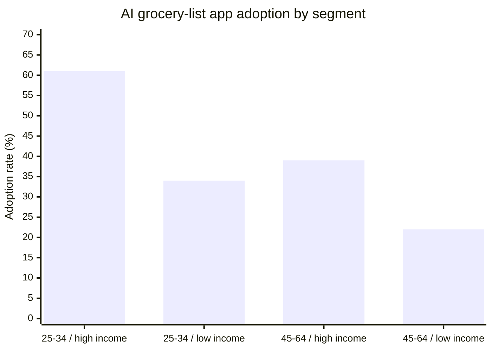

# Market Research Report: Household Adoption of AI-Assisted Grocery List Apps (U.S., 2026)

Commissioned by a national grocery retailer (client withheld under NDA). Scope:
U.S. households that make the primary grocery-shopping decisions for their
household.

## Background & Objectives

The client is evaluating whether to integrate an AI-assisted grocery-list
feature (auto-generated lists from purchase history and pantry input) into its
loyalty app. Before committing engineering budget, the client needs to know
current adoption of comparable AI-assisted list apps, the barriers holding
non-adopters back, and which household segments are the most promising launch
targets. Objectives: (1) measure current adoption incidence and its drivers,
(2) identify the leading barriers among non-adopters, (3) compare adoption
across age and household-income segments, (4) recommend a launch segment and
positioning.

## Methodology

**Research design.** A single-wave quantitative online survey.

**Sampling.** Frame: a national online panel of U.S. adults aged 25-64 who
self-identify as the primary grocery-shopping decision-maker in their
household. Method: stratified random sample, stratified by U.S. Census region
and quota-balanced across three household-income terciles. Size: n = 1,050
completed interviews.

**Instrument.** A 22-item structured questionnaire covering current
grocery-list habits, awareness and use of AI-assisted list apps, barriers to
adoption, and household demographics. Median completion time: 9 minutes.

**Fieldwork.** Online, 2026-01-15 to 2026-02-02. 1,050 completions from 3,830
panel invitations (27.4% completion rate).

**Verification gate.** Of the findings drafted from this fieldwork, one
analyst projection (household penetration reaching 60% within three years) was
falsified against the observed adoption curve and is excluded from Findings
below — it is named here only as an excluded projection. One finding (price as
the single decisive adoption driver) was weakened by conflicting qualitative
signal in the open-ends and is retained below with an explicit uncertainty
flag rather than dropped.

## Findings

### Adoption incidence

41% of surveyed households report having used an AI-assisted grocery-list app
at least once in the past 90 days, per this study's fieldwork. Awareness (78%)
substantially exceeds trial (41%), indicating an awareness-to-trial gap rather
than an awareness problem.

### Segment comparison

Adoption varies sharply by age and household income:

| Segment | Adoption rate | n | Weighted margin of error |
| --- | --- | --- | --- |
| Age 25-34, top income tercile | 61% | 178 | ±5.8pp |
| Age 25-34, bottom income tercile | 34% | 142 | ±6.3pp |
| Age 45-64, top income tercile | 39% | 165 | ±6.0pp |
| Age 45-64, bottom income tercile | 22% | 151 | ±6.1pp |

### Barriers among non-adopters

The leading barrier is trust in an automated tool to correctly infer what the
household needs (cited by 52% of non-adopters), followed by habit — "I already
have a system that works" (44%). Price sensitivity is a contributing but
weakened signal: it was cited as a top-three barrier by 31% of non-adopters,
but open-end responses suggest respondents frequently conflated "price of the
app" with "price of groceries," so this finding should be treated as
directional, not decisive.

## Conclusions & Recommendations

The awareness-to-trial gap, not awareness itself, is the primary obstacle: the
client's loyalty-app integration should prioritize a low-friction trial
mechanism (e.g. a one-tap "try it on your next list" prompt) over further
awareness spend. The 25-34 / top-income-tercile segment is the strongest launch
target, showing the highest adoption and the smallest trust barrier; a phased
launch should target this segment first, then extend to the 45-64 segments
with trust-building messaging (data-handling transparency, a manual-override
option) once trial mechanics are proven. Price-based positioning is not
recommended as a primary lever given the weakened evidence on price
sensitivity.

## Technical Appendix

### Sampling & weighting

Stratified random sample (region x income tercile), n = 1,050, weighted to
U.S. Census region and household-income distribution for households with
primary grocery-shopping responsibility.

### Instrument

22-item structured questionnaire; median completion time 9 minutes; fielded
via the panel provider's standard online survey platform.

### Fieldwork log

Online fieldwork, 2026-01-15 to 2026-02-02. 3,830 invitations, 1,050
completions, 27.4% completion rate.

### Data quality and limitations

Single-panel sample; findings may not generalize to households recruited
outside online panels. The price-sensitivity finding is retained as weakened
evidence per the verification gate above rather than presented as settled.

### Standards note

This report follows the widely used ESOMAR-style market-research report
structure as a matter of **conventional practice**, not because it conforms to
a codified format standard — ESOMAR/ICC publishes an ethics and conduct code,
not a report-format mandate, and this report does not claim ESOMAR
conformance. Any reference to ISO 20252 quality practice should be checked
against the current edition live at the time of use, since the standard is
under active revision (2024-2026).

### Sources

1. ESOMAR — <https://esomar.org/>
