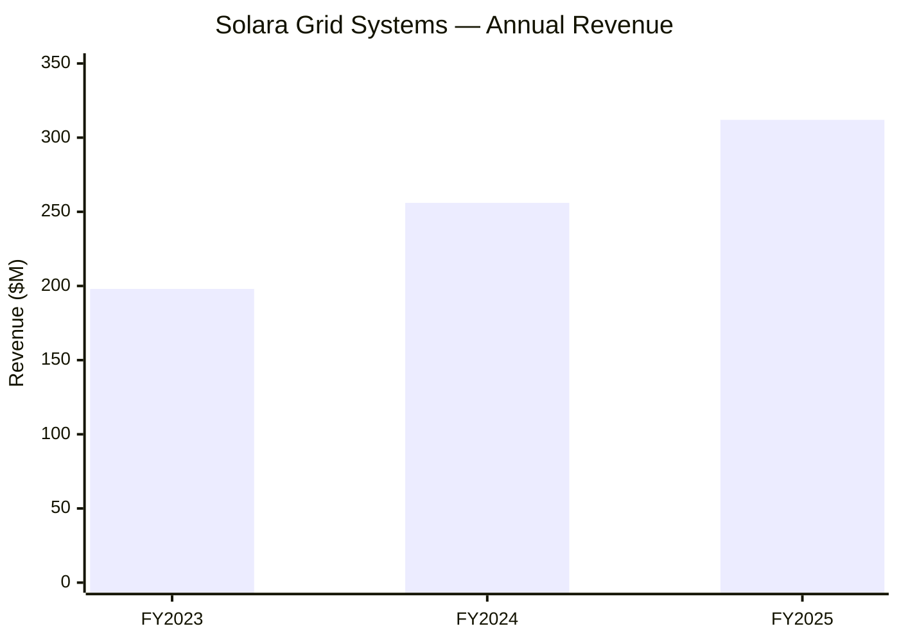

# Solara Grid Systems, Inc. — Annual Disclosure Report, Fiscal Year 2025

*This is a fictional company and fiscal year, used to illustrate the disclosure
genre's structure. It is not an actual SEC filing.*

Cover: Solara Grid Systems, Inc., a Delaware corporation, commercial and
industrial solar-plus-storage developer. Reporting period: fiscal year ended
December 31, 2025.

## Business (Item 1)

Solara Grid Systems designs, finances, and operates solar-plus-storage
installations for commercial and industrial customers across the western
United States. The company originates projects, arranges third-party project
financing, and retains long-term operations-and-maintenance contracts. As of
fiscal year-end 2025, Solara Grid operated 214 installations totaling 480
megawatts of contracted capacity across 11 states.

## Risk Factors (Item 1A)

The most significant risks, in order of materiality:

1. **Customer concentration.** The company's ten largest offtake customers
   account for 41% of contracted revenue; loss of any one could materially
   reduce recurring revenue.
2. **Interconnection queue delays.** 38% of the fiscal-2025 project backlog is
   subject to utility interconnection queues with no committed completion
   date; delays defer recognized revenue.
3. **Federal tax-credit policy risk.** A material share of project economics
   depends on federal investment tax credits; a change in credit eligibility
   or transferability rules could reduce project returns on future
   originations.
4. **Component supply risk.** Battery-cell and inverter supply is concentrated
   among a small number of manufacturers; a supply disruption could delay
   installations already under contract.

## Properties & Legal Proceedings (Items 2-3)

Solara Grid leases its corporate headquarters in Denver, Colorado, and owns no
generation assets directly — installations are held by project-level special
purpose entities in which the company holds a managing interest. The company
is a defendant in one pending matter: a subcontractor payment dispute related
to a 2024 installation, seeking $2.3 million in damages. Management does not
believe the outcome will be material to the company's financial condition.

## Selected Financial Data

**N/A.** Item 301 of Regulation S-K (Selected Financial Data) was eliminated
by SEC Release No. 33-10890, effective for fiscal years ending on or after
August 9, 2021 [1]. The multi-period financial highlights formerly presented
here are folded into Management's Discussion & Analysis below.

## Management's Discussion & Analysis (MD&A, Item 7)

**Results of operations.** Fiscal-2025 revenue was $312 million, up 22% from
$256 million in fiscal-2024, driven by 61 new installations placed in service
during the year. Operating margin expanded 180 basis points year over year to
14.2%, primarily from lower per-watt installation costs as battery-cell prices
declined.

### Figure 1 — Revenue trend, FY2023-FY2025 ($ millions)

**Liquidity and capital resources.** The company held $84 million in
unrestricted cash at fiscal year-end 2025, plus a $150 million undrawn
revolving credit facility. Project-level financing is non-recourse to the
parent company. Management believes existing liquidity is sufficient to fund
the current 24-month project pipeline.

**Known trends and uncertainties.** The interconnection queue delays
described in Risk Factors above are expected to defer approximately $40
million of fiscal-2026 revenue recognition into fiscal-2027; the exact timing
is uncertain and depends on utility-specific queue processing that the
company does not control.

## Financial Statements & Supplementary Data (Item 8)

| Metric | FY2023 | FY2024 | FY2025 |
| --- | --- | --- | --- |
| Revenue | $198M | $256M | $312M |
| Operating margin | 11.8% | 12.4% | 14.2% |
| Installations in service | 98 | 153 | 214 |
| Contracted capacity | 210 MW | 340 MW | 480 MW |

Notes to the financial statements, including project-entity consolidation
policy and revenue-recognition timing for interconnection-delayed projects,
are incorporated by reference to the audited statements filed as an exhibit to
this report.

## Controls & Procedures

Management evaluated the design and operation of the company's disclosure
controls and procedures as of December 31, 2025, and concluded they were
effective. No material weakness in internal control over financial reporting
was identified during fiscal-2025.

## References

1. U.S. Securities and Exchange Commission, Release No. 33-10890, *Management's
   Discussion and Analysis, Selected Financial Data, and Supplementary
   Financial Information* — <https://www.sec.gov/files/rules/final/2020/33-10890.pdf>
2. U.S. Securities and Exchange Commission, Regulation S-K (17 CFR Part 229) —
   <https://www.ecfr.gov/current/title-17/chapter-II/part-229?toc=1>
