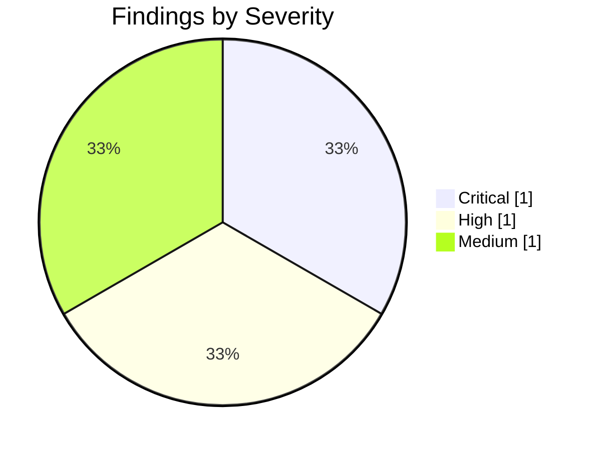

# Penetration Test Report: Brightleaf Retail — External Web Application Assessment

*Brightleaf Retail Co. is a fictional company used for illustration.*

## Authorization & Scope Statement

This engagement was authorized by Brightleaf Retail Co. under signed statement
of work SOW-2026-0417. In-scope targets: `shop.brightleaf.example` and
`staging.brightleaf.example`, and their supporting API hosts. Rules of
engagement: no denial-of-service testing, business hours only, immediate
notification for any finding rated Critical. Testing window: 2026-06-08
through 2026-06-19.

## Part 1 — Executive Summary

### Background

Brightleaf Retail Co. engaged this assessment to evaluate the external attack
surface of its customer-facing web storefront ahead of a planned holiday
traffic increase. The objective was to identify exploitable weaknesses in the
public application and its supporting infrastructure before an external
attacker could.

### Posture

The storefront's overall external security posture is **weak**. A critical
authentication-bypass vulnerability was demonstrated to give an unauthenticated
attacker full account takeover, and a forgotten staging environment exposed an
administrative interface to the internet without any authentication control.

### Risk Profile

Three findings survived verification. One is rated Critical, one High, and one
Medium.

### General Findings

Two systemic themes emerged: (1) input handling on authentication-adjacent
endpoints is not validated against injection, and (2) non-production
environments are deployed without the same authentication controls required
of production, leaving them reachable from the public internet.

### Recommendation Summary

1. Remediate the SQL injection finding immediately; it is the highest-impact
   path to full compromise.
2. Remove public network reachability from all non-production environments
   and require authentication on any administrative interface, production or
   not.
3. Adopt parameterized queries and an output-encoding standard across the
   application to close the underlying input-handling gap.

### Strategic Roadmap

- **Short term (0-30 days):** patch the SQL injection finding; take the
  staging admin panel off the public internet.
- **Medium term (30-90 days):** roll out parameterized-query and
  output-encoding standards across all customer-facing services; add
  automated SAST/DAST coverage for injection classes to the CI pipeline.
- **Long term (90+ days):** require environment-parity authentication controls
  (production and non-production alike) as a release gate, verified in the
  next engagement.

## Part 2 — Technical Report

### Information Gathering

Passive and active reconnaissance enumerated the public DNS zone for
`brightleaf.example`, identifying `shop.brightleaf.example` (production) and
an unlisted `staging.brightleaf.example` host discovered via certificate-
transparency log review. Both hosts were fingerprinted for running services
and application framework versions.

### Vulnerability Assessment

- The login endpoint (`POST /api/v1/auth/login`) on `shop.brightleaf.example`
  reflected database error text when a single quote was submitted in the
  `email` parameter, indicating unsanitized input reaching a SQL query
  (CWE-89 SQL Injection).
- The discovered `staging.brightleaf.example` host served `/admin` with no
  authentication prompt of any kind (CWE-306 Missing Authentication for a
  Critical Function).
- The storefront's product-search field (`GET /search?q=`) reflected
  unescaped input directly into the results page (CWE-79 Cross-Site
  Scripting).

### Exploitation / Confirmation

The login endpoint's `email` parameter was confirmed exploitable with a
boolean-based blind SQL injection payload, allowing authentication bypass
without valid credentials — **confirmed**, not theoretical. The staging
admin panel was reached directly by URL with no authentication step required
— **confirmed**. The search-field XSS was confirmed to execute injected
script in a test browser session — **confirmed**.

### Post-Exploitation

Using the SQL-injection-derived authentication bypass, the assessment team
accessed an authenticated customer account and confirmed the ability to read
other customers' order history through an adjacent insecure direct object
reference, demonstrating a realistic path from injection to customer-data
exposure. No further lateral movement into backend infrastructure was
attempted, per the rules of engagement.

### Risk / Remediation

| Finding | CVSS v4.0 severity | Affected asset | Evidence | Remediation |
| --- | --- | --- | --- | --- |
| SQL injection — authentication bypass on login | **Critical** (9.3) | `shop.brightleaf.example` `/api/v1/auth/login` | Boolean-based blind injection confirmed via `email` parameter; see Exploitation | Use parameterized queries / prepared statements for all authentication queries; add input validation |
| Staging admin panel exposed with no authentication | **High** (8.6) | `staging.brightleaf.example` `/admin` | Direct URL access reached the admin panel with no auth prompt | Remove public network reachability from non-production hosts; require authentication parity with production |
| Reflected XSS in product search | **Medium** (6.1) | `shop.brightleaf.example` `/search` | Injected script executed in test browser session | Apply context-aware output encoding to search-result rendering; add a Content-Security-Policy header |

## References

1. CWE-89: SQL Injection — <https://cwe.mitre.org/data/definitions/89.html>
2. CWE-306: Missing Authentication for a Critical Function — <https://cwe.mitre.org/data/definitions/306.html>
3. CWE-79: Cross-Site Scripting — <https://cwe.mitre.org/data/definitions/79.html>
4. OWASP Top 10 (2021) — <https://owasp.org/Top10/>
5. FIRST CVSS — Common Vulnerability Scoring System — <https://www.first.org/cvss/>

<!--
MIF Level 1 (floor): id, type, created + body. A complete, valid
penetration-test report — but opaque to a machine consumer. It cannot be
queried for "is this risk picture still current?", "where did this finding's
evidence come from?", or "what relates to this engagement?". Compare
templates/good.md (full L3: temporal validity, W3C-PROV provenance, per-finding
citations, typed relationships). Gate: mif-validate --level 1.
-->
