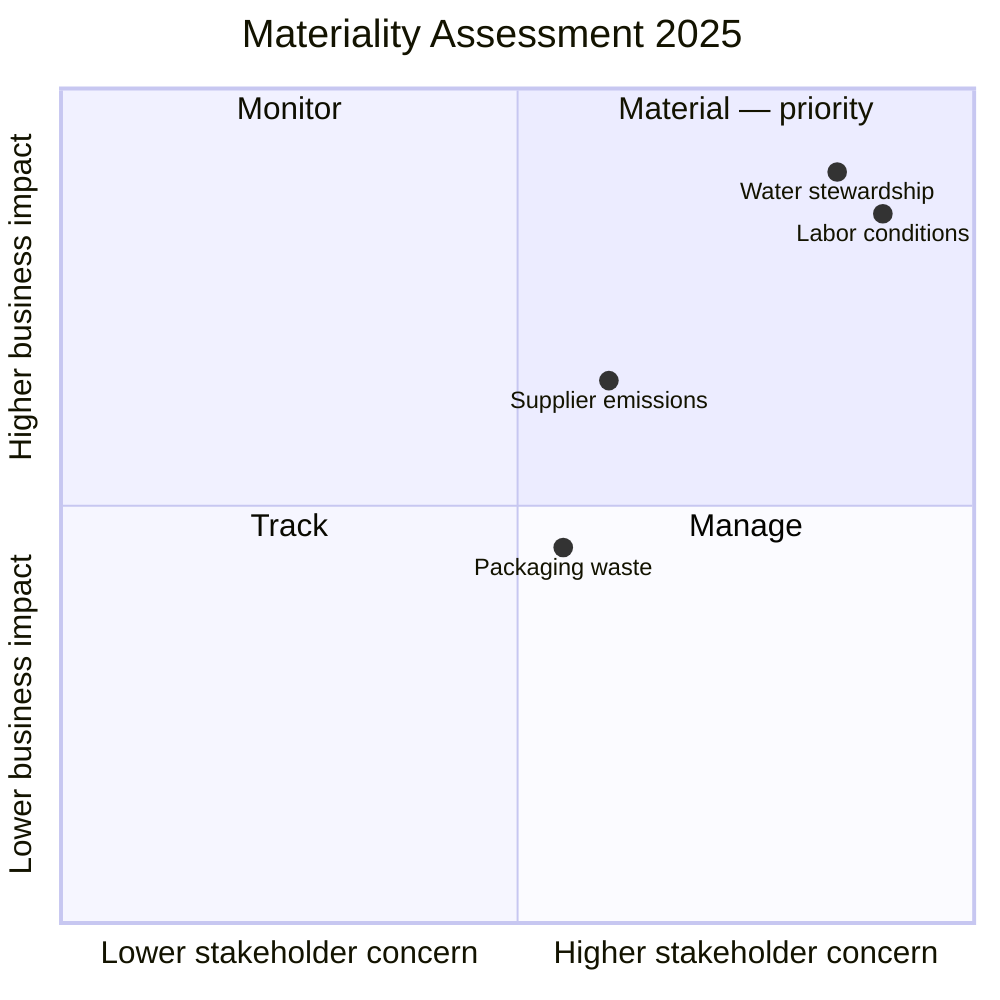

# Solvane Textiles Group — Sustainability Report 2025

Scope caveat: this report reproduces the **GRI Standards** reporting
structure. It does not assert assurance, third-party verification, or full
"in accordance with GRI" conformance.

## GRI 1 — Foundation

This report applies the GRI Standards' reporting principles — accuracy,
balance, comparability, and verifiability — to the 2025 fiscal year (1
January 2025 to 31 December 2025). Reporting boundary: all wholly owned
manufacturing and distribution operations; joint ventures are excluded.

## GRI 2 — General Disclosures

Solvane Textiles Group operates 9 manufacturing sites across 4 countries with
approximately 14,500 employees. Sustainability governance sits with a
board-level Sustainability Committee that meets quarterly and reports
directly to the CEO. Stakeholder engagement in 2025 included supplier
audits, an employee survey, and a community consultation in each
manufacturing region.

## GRI 3 — Material Topics

The 2025 materiality determination combined stakeholder engagement (supplier
audits, employee survey, community consultation) with an internal impact
assessment across the value chain. Two topics were prioritized as most
material: **water stewardship** in dyeing and finishing operations, and
**labor conditions** across the direct manufacturing workforce. Both topics
carry the highest combined score on likelihood and severity of impact and
were escalated to the Sustainability Committee for direct oversight.

## Topic Standards

### GRI 303 — Water and Effluents (environmental)

Water withdrawal intensity in dyeing and finishing operations fell 9% per
tonne of fabric produced, from 38 m³/tonne in 2024 to 34.6 m³/tonne in 2025,
across the 9-site reporting boundary.

### GRI 305 — Emissions (environmental)

Absolute Scope 1 and Scope 2 emissions fell 7% year over year to 210,000
tonnes CO2e, driven primarily by the conversion of two dyeing facilities to
grid-supplied renewable electricity.

### GRI 401 — Employment (social)

Employee turnover across the direct manufacturing workforce was 11.4% in
2025, down from 14.2% in 2024, following the introduction of a shift-pattern
review at the two highest-turnover sites.

### GRI 407 — Freedom of Association and Collective Bargaining (social)

100% of direct manufacturing sites operate under collective bargaining
agreements recognized by the applicable national labor authority; no sites
reported restrictions on freedom of association in the 2025 supplier audit
cycle.

## GRI Content Index

| GRI Standard | Disclosure | Location | Omission |
| --- | --- | --- | --- |
| GRI 2: General Disclosures 2021 | 2-1 Organizational details | GRI 2 — General Disclosures | None |
| GRI 2: General Disclosures 2021 | 2-9 Governance structure | GRI 2 — General Disclosures | None |
| GRI 2: General Disclosures 2021 | 2-29 Approach to stakeholder engagement | GRI 2 — General Disclosures | None |
| GRI 3: Material Topics 2021 | 3-1 Process to determine material topics | GRI 3 — Material Topics | None |
| GRI 3: Material Topics 2021 | 3-2 List of material topics | GRI 3 — Material Topics | None |
| GRI 303: Water and Effluents 2018 | 303-5 Water consumption | Topic Standards — GRI 303 | None |
| GRI 305: Emissions 2016 | 305-1/305-2 Direct and energy indirect GHG emissions | Topic Standards — GRI 305 | None |
| GRI 401: Employment 2016 | 401-1 New employee hires and employee turnover | Topic Standards — GRI 401 | None |
| GRI 407: Freedom of Association and Collective Bargaining 2016 | 407-1 Operations at risk | Topic Standards — GRI 407 | None |

## References

1. GRI Standards — <https://www.globalreporting.org/standards/>
2. GRI Universal Standards (GRI 1, GRI 2, GRI 3) — <https://www.globalreporting.org/standards/standards-development/universal-standards/>
3. GRI Topic Standards (GRI 200/300/400 series) — <https://www.globalreporting.org/standards/standards-development/topic-standards/>

<!--
MIF Level 1 (floor): id, type, created + body. A complete, valid
sustainability report — but opaque to a machine consumer. It cannot be
queried for "is this disclosure still current for this reporting period?",
"where did the evidence come from?", or "what formalizes or relates to it?".
Compare templates/good.md (full L3: temporal validity, W3C-PROV provenance,
per-disclosure citations, typed relationships).
Gate: mif-validate --level 1.
-->
