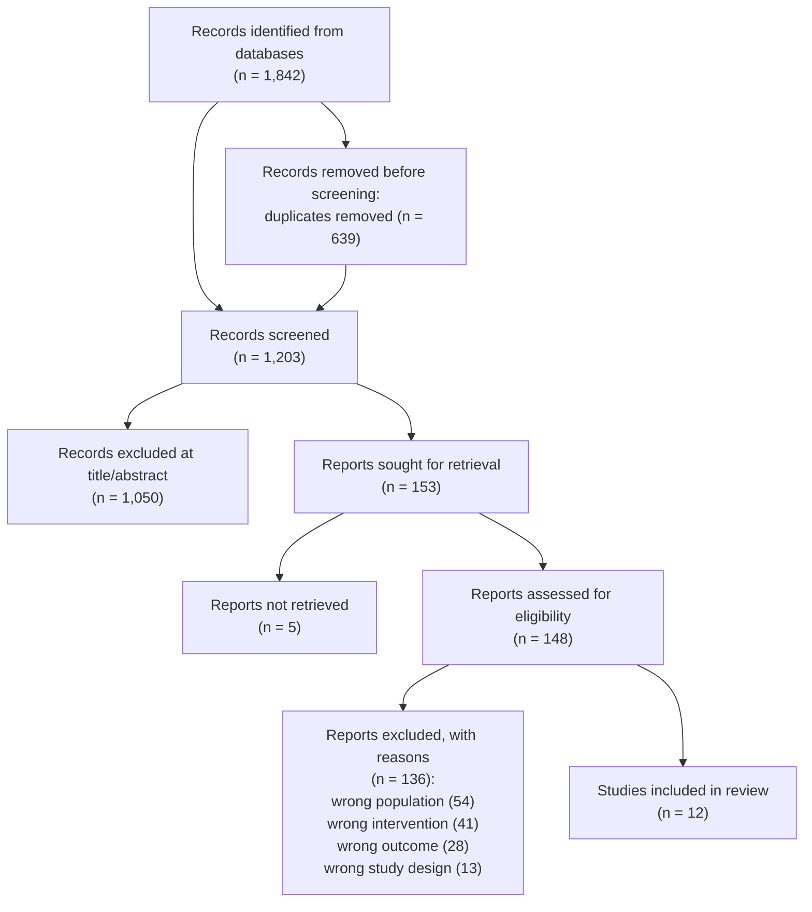

# Telehealth-Delivered Cognitive Behavioral Therapy for Adult Depression: A Systematic Review

## Structured Abstract

**Background.** Cognitive behavioral therapy (CBT) delivered by videoconference
or telephone has expanded rapidly, but its comparability to in-person CBT for
adult depression remains a question for clinicians allocating limited
therapist time. **Objectives.** To determine whether telehealth-delivered CBT
produces depression-symptom outcomes comparable to in-person CBT in adults with
a primary diagnosis of major depressive disorder. **Eligibility criteria.**
Randomized controlled trials comparing telehealth-delivered CBT (videoconference
or telephone) against in-person CBT or a waitlist/care-as-usual control, in
adults (18+) with a primary diagnosis of major depressive disorder, reporting a
validated depression-symptom outcome measure. **Information sources.**
MEDLINE, PsycINFO, and the Cochrane Central Register of Controlled Trials
(CENTRAL), searched from inception to 2026-05-01. **Methods of synthesis.**
Narrative synthesis of standardized mean differences in depression-symptom
change, stratified by comparator (in-person CBT vs. waitlist/care-as-usual);
meta-analysis was not performed because of comparator heterogeneity.
**Results.** Twelve randomized controlled trials (total N not pooled across
comparators) met eligibility criteria. Telehealth-delivered CBT showed
depression-symptom outcomes broadly equivalent to in-person CBT, and superior
outcomes relative to waitlist/care-as-usual. **Conclusions.** Telehealth CBT is
a reasonable substitute for in-person CBT in adult depression when in-person
delivery is not feasible; the evidence base has moderate risk-of-bias
limitations concentrated in blinding of outcome assessment.

## Introduction

**Rationale.** Access to in-person CBT for depression is constrained by
therapist availability and geography, and telehealth delivery has been
proposed as a scalable substitute. Prior narrative reviews have summarized
individual trials but have not applied a reproducible, PRISMA-conformant
selection process to the current evidence base. **Objectives.** Framed as a
PICO question: in adults with major depressive disorder (**P**opulation), does
telehealth-delivered CBT (**I**ntervention), compared with in-person CBT or
waitlist/care-as-usual (**C**omparison), produce non-inferior or superior
depression-symptom outcomes (**O**utcome)?

## Methods

**Eligibility criteria.** Randomized controlled trials; adult participants
(18+) with a primary diagnosis of major depressive disorder established by a
structured clinical interview or validated diagnostic instrument; telehealth
CBT delivered by videoconference or telephone; comparator of in-person CBT or
waitlist/care-as-usual; a validated depression-symptom outcome measure (e.g.
PHQ-9, BDI-II, HAM-D) reported at post-treatment. Excluded: non-randomized
designs, pediatric or geriatric-only samples, and trials of internet-delivered
self-guided CBT with no live therapist contact.

**Information sources.** MEDLINE (via PubMed), PsycINFO, and the Cochrane
Central Register of Controlled Trials (CENTRAL); database inception through
2026-05-01. Reference lists of included trials and relevant prior reviews were
hand-searched for additional eligible trials.

**Search strategy.** Combined controlled vocabulary and free-text terms across
three concepts: depression (`"depressive disorder"[MeSH]` OR `depress*`), CBT
(`"cognitive behavioral therapy"[MeSH]` OR `"CBT"` OR `"cognitive therapy"`),
and telehealth delivery (`telehealth` OR `telemedicine` OR `videoconferenc*` OR
`"remote delivery"` OR `telephone`), combined with `AND`, limited to randomized
controlled trials via a validated RCT filter.

**Selection process.** Two reviewers independently screened titles and
abstracts, then independently assessed full texts of records advancing past
screening; disagreements were resolved by discussion, with a third reviewer
adjudicating unresolved conflicts.

**Data items.** For each included trial: sample size per arm, mean age,
diagnostic instrument, telehealth modality (videoconference vs. telephone),
CBT protocol and session count, comparator arm, depression-outcome instrument,
and post-treatment effect estimate.

**Risk-of-bias assessment.** Each included trial was appraised with the
Cochrane Risk-of-Bias tool for randomized trials (RoB 2), across five domains:
randomization process, deviations from intended interventions, missing outcome
data, measurement of the outcome, and selection of the reported result.

## Results

### Study Selection

Records identified (1,842) minus duplicates removed before screening (639)
equal records screened (1,203). Records screened (1,203) minus records
excluded at title/abstract (1,050) equal reports sought for retrieval (153).
Reports sought (153) minus reports not retrieved (5) equal reports assessed
for eligibility (148). Reports assessed (148) minus reports excluded with
reasons (136) equal studies included (12) — the flow reconciles at every
stage.

### Risk of Bias

| Study | Randomization | Deviations | Missing data | Outcome measurement | Selection of result | Overall |
| --- | --- | --- | --- | --- | --- | --- |
| Included Study 1 | Low | Low | Low | Some concerns | Low | Some concerns |
| Included Study 2 | Low | Low | Low | Low | Low | Low |
| Included Study 3 | Some concerns | Low | Some concerns | Some concerns | Low | Some concerns |
| Included Study 4 | Low | Some concerns | Low | Low | Low | Some concerns |
| Included Study 5 | Low | Low | Low | Low | Low | Low |
| Included Study 6 | Some concerns | Some concerns | Some concerns | High | Low | High |
| Included Study 7 | Low | Low | Low | Some concerns | Low | Some concerns |
| Included Study 8 | Low | Low | Low | Low | Low | Low |
| Included Study 9 | Some concerns | Low | Low | Some concerns | Low | Some concerns |
| Included Study 10 | Low | Low | Some concerns | Low | Low | Some concerns |
| Included Study 11 | Low | Low | Low | Low | Low | Low |
| Included Study 12 | Some concerns | Some concerns | Low | Some concerns | Low | Some concerns |

### Synthesis of Results

Nine of the 12 included trials compared telehealth CBT against in-person CBT;
across these, post-treatment depression-symptom scores did not differ in a
way that would suggest telehealth delivery is inferior, and effect estimates
clustered close to a standardized mean difference of zero. The remaining
three trials compared telehealth CBT against waitlist/care-as-usual; all
three favored telehealth CBT, consistent with CBT's established efficacy over
no active treatment regardless of delivery modality. The one trial rated
overall "High" risk of bias (Included Study 6) showed the largest effect in
favor of telehealth CBT and is flagged as a driver of caution in the
Discussion rather than folded into the headline synthesis.

## Discussion

**Limitations.** No meta-analysis was performed because comparator groups
(in-person CBT vs. waitlist/care-as-usual) were not clinically or
statistically poolable; the narrative synthesis therefore cannot report a
single pooled effect size. Five of twelve trials were rated "Some concerns" or
"High" on outcome-measurement risk of bias, largely reflecting unblinded
self-report outcome measures — a structural limitation of psychotherapy
trials generally, not unique to telehealth delivery. The search was limited
to three databases and English-language publications, which may have missed
non-English trials. **Conclusions.** Telehealth-delivered CBT for adult
depression produces outcomes broadly comparable to in-person CBT and superior
outcomes relative to no active treatment, with a moderate but not
disqualifying risk-of-bias profile concentrated in outcome-measurement
blinding.

## Registration & Protocol

This review was not prospectively registered, and no protocol was published in
advance of conducting the review. This is stated explicitly per PRISMA 2020
"Other information" reporting requirements.

## References

1. Page MJ, McKenzie JE, Bossuyt PM, et al. The PRISMA 2020 statement: an
   updated guideline for reporting systematic reviews. *BMJ*. 2021;372:n71.
   <https://doi.org/10.1136/bmj.n71>
2. Sterne JAC, Savović J, Page MJ, et al. RoB 2: a revised tool for assessing
   risk of bias in randomised trials. *BMJ*. 2019;366:l4898.
   <https://doi.org/10.1136/bmj.l4898>

<!--
MIF Level 1 (floor): id, type, created + body. A complete, valid PRISMA
systematic review — but opaque to a machine consumer. It cannot be queried for
"is this evidence still current?", "where did each claim come from?", or "what
downstream document does this review inform?". Compare templates/good.md
(full L3: temporal validity, W3C-PROV provenance, citations, typed
relationships). Gate: mif-validate --level 1.
-->
