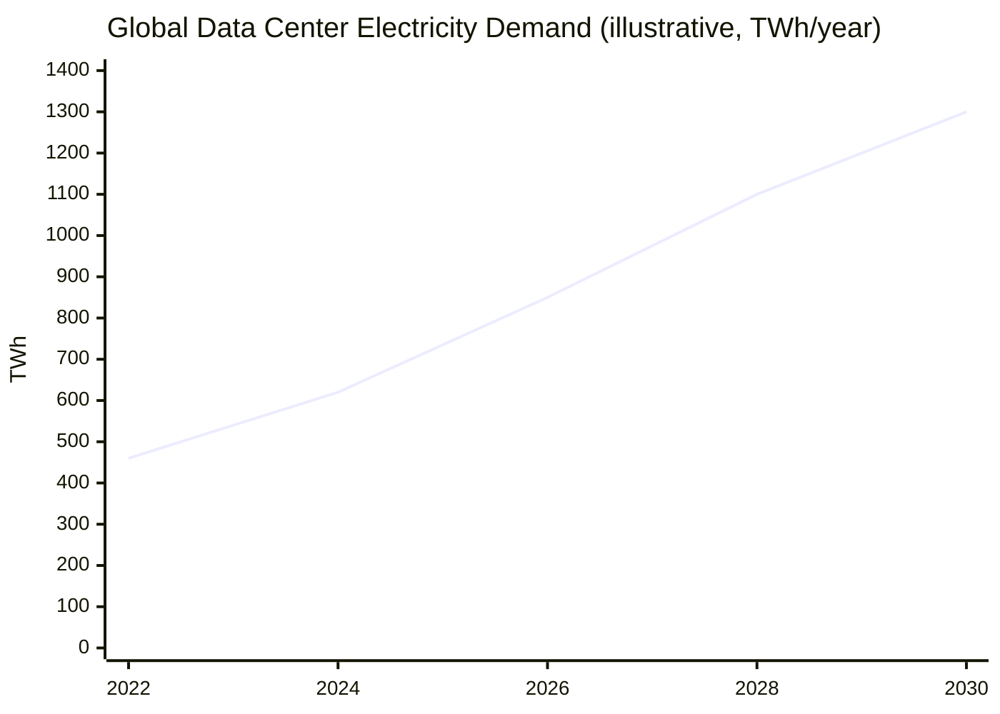
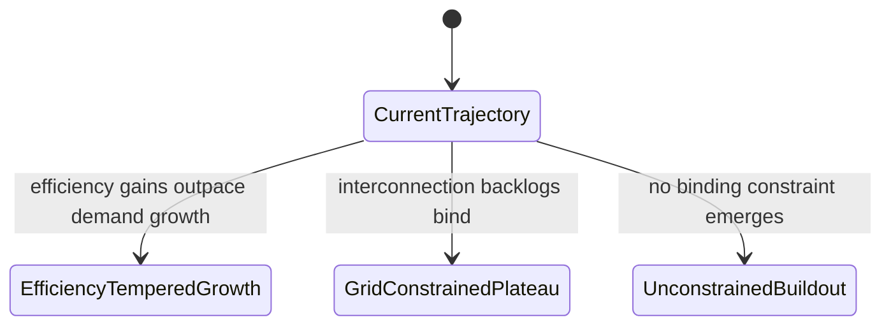

# Trend Analysis: Global Data Center Electricity Demand

As-of: 2026-03-01. Horizon: through 2030.

## Trajectory

Global data center electricity consumption has been rising steadily since
2022, driven by cloud growth and, since 2023, by the buildout of AI training
and inference capacity. The IEA's *Electricity 2024* report projected global
data center electricity use could roughly double from its 2022 level over the
following several years, driven disproportionately by AI-optimized facilities
[1]. Through early 2026, hyperscaler capital expenditure and reported grid
interconnection requests are consistent with that upward trajectory
continuing, not plateauing.

## Signals

- **Leading — hyperscaler AI infrastructure capex.** Public earnings
  disclosures from major cloud providers show capital expenditure directed at
  AI-optimized data centers rising sharply since 2023, ahead of any
  corresponding rise in metered electricity consumption — a leading signal of
  future demand.
- **Leading — utility large-load interconnection requests.** Trade press and
  utility regulatory filings report a growing backlog of large-load
  interconnection requests specifically tied to data center campuses, a
  leading signal that developers are queuing capacity ahead of need.
- **Lagging — metered electricity consumption.** Actual metered consumption
  by data center operators, reported with a lag of one to two years by grid
  operators, confirms rather than predicts the trend — it lags the capex and
  interconnection signals above.

## Drivers & Inhibitors

### Drivers

- Continued growth in AI training and inference workloads.
- Ongoing migration of on-premise compute to hyperscale and colocation
  facilities.

### Inhibitors

- Grid interconnection queues and transmission buildout timelines, which in
  several regions now measure in years rather than months.
- Chip supply constraints on the accelerators that AI-optimized facilities
  are built around.
- Per-workload efficiency gains (better silicon, cooling, and scheduling),
  which partially offset gross demand growth.

## Scenarios

Horizon: through 2030.

1. **Efficiency-tempered growth** (moderate confidence) — efficiency gains in
   silicon and cooling offset a meaningful share of gross demand growth;
   consumption keeps rising but below the steepest historical rate. Trigger:
   continued generational efficiency improvement in AI accelerators.
2. **Grid-constrained plateau** (moderate confidence) — interconnection
   queues and transmission buildout become the binding constraint,
   flattening growth in constrained regions even as demand for capacity
   continues. Trigger: sustained multi-year interconnection backlogs in
   major grid regions.
3. **Unconstrained AI buildout** (lower confidence) — capex and
   interconnection signals continue at their current pace, and consumption
   tracks the steeper end of published projections. Trigger: no material
   grid or chip-supply bottleneck emerges before 2030.

## Implications & Watch-list

- Monitor hyperscaler capex guidance each earnings cycle for a change in the
  rate of AI-infrastructure investment.
- Monitor utility large-load interconnection queue lengths in major grid
  regions as the clearest leading indicator of a binding grid constraint.
- Monitor accelerator generational efficiency (performance-per-watt) claims
  at each major chip launch as the clearest leading indicator of the
  efficiency-tempered scenario.

## References

1. IEA, *Electricity 2024* — <https://www.iea.org/reports/electricity-2024>

<!--
MIF Level 1 (floor): id, type, created + body. A complete, valid trend-analysis
report — but opaque to a machine consumer. It cannot be queried for "is this
trajectory reading still current?", "where did a signal come from?", or "what
formalizes or relates to it?". Compare templates/good.md (full L3: temporal
validity, W3C-PROV provenance, per-signal citations, typed relationships).
Gate: mif-validate --level 1.
-->
